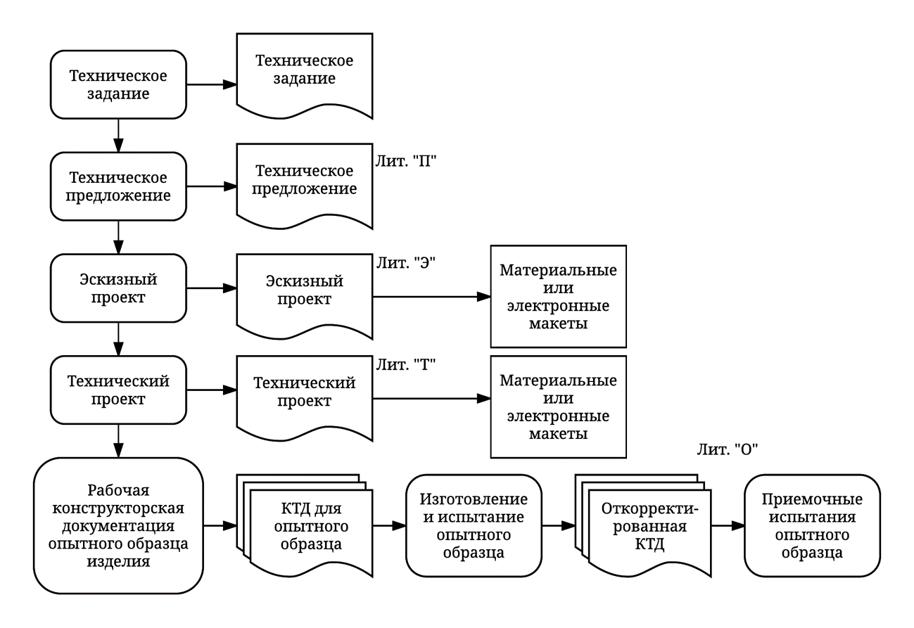
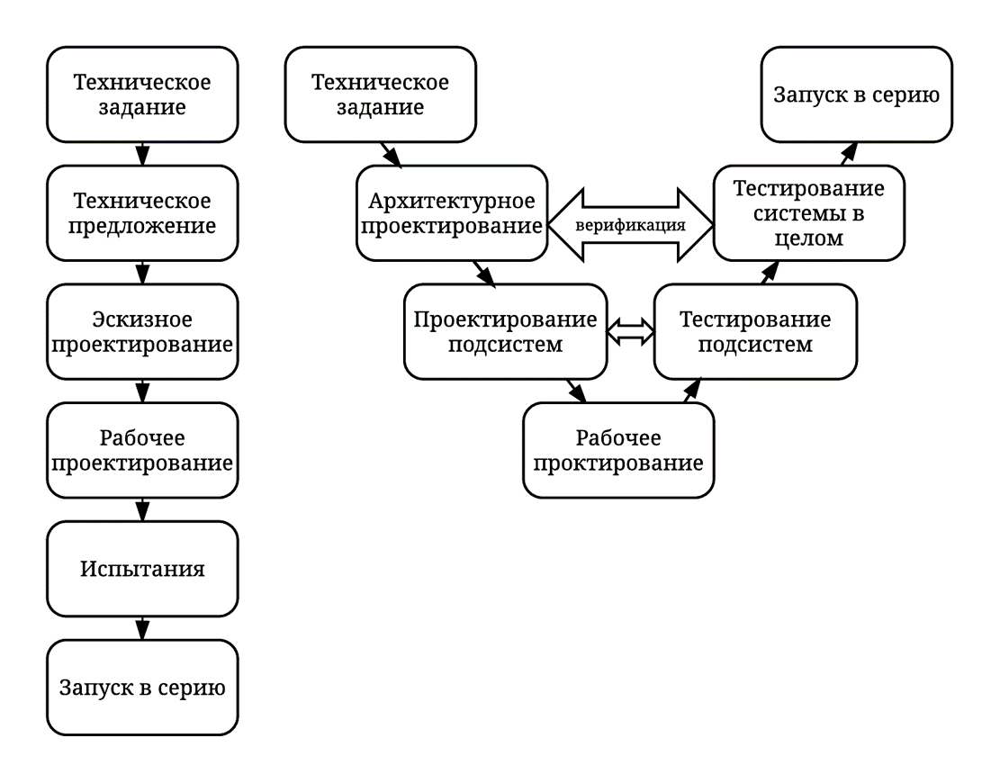
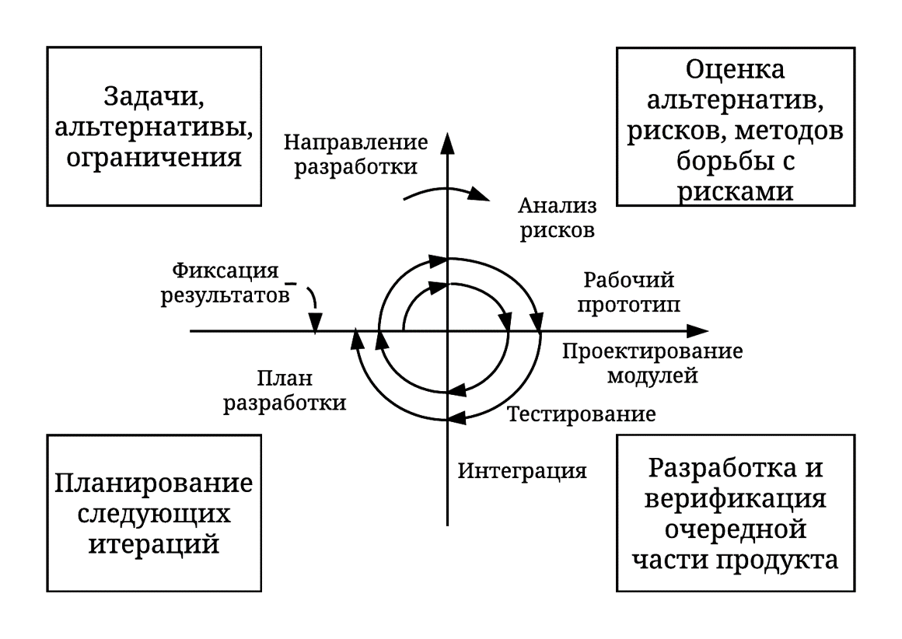
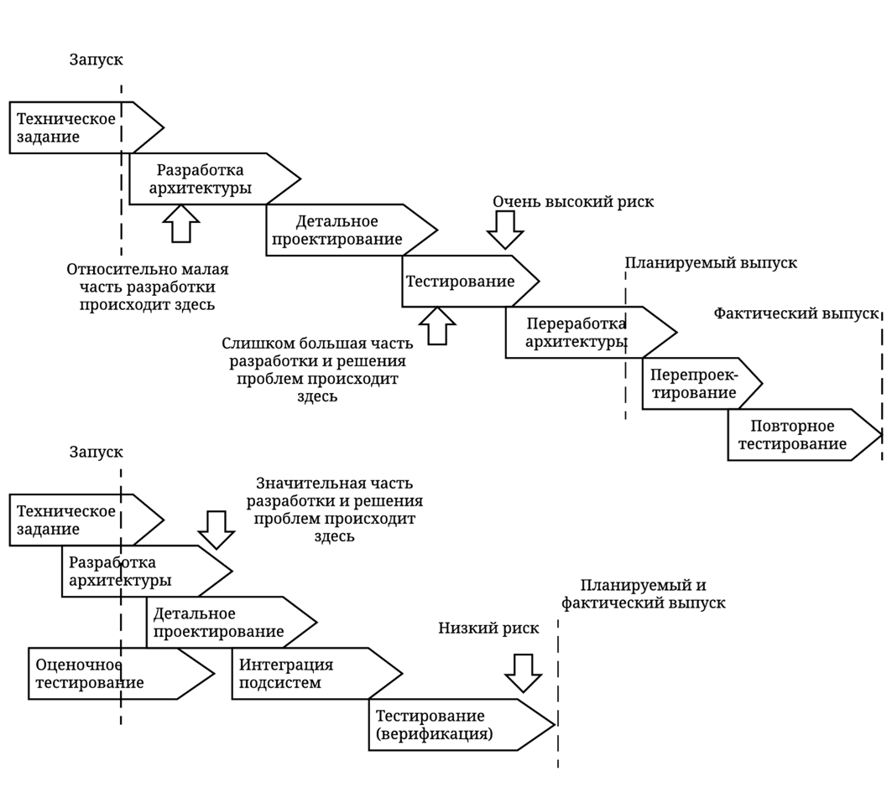

___
# Вопрос 1: Проектирование. Стадии проектирование. Стандарты, описывающие проектирование. Модели проектирования (каскадная, V-модель, спиральная, альтернативные модели).
___

**Проектирование** — процесс составления описания, необходимого для создания в заданных условиях еще не существующего объекта, на основе первичного описания этого объекта и (или) алгоритма его функционирования.

### Стадии проектирования
* **предпроектные исследования**;
* **разработка технического задания**;
* **разработка технического предложения** 
(Техническое предложение - совокупность проектных КД, которые должны содержать технические и технико-экономические обоснования целесообразности разработки документации изделия на основании анализа ТЗ и различных вариантов возможных решений изделий, сравнительной оценки решений с учетом конструктивных и эксплуатационных особенностей разрабатываемого и существующих изделий, а также патентные исследования);
* **разработка эскизногой проекта**
(Эскизный проект - совокупность проектных КД, которые должны содержать принципиальные конструктивные решения, дающие общее представление о назначении, об устройстве, принципе работы и габаритных размерах разрабатываемого изделия, а также данные, определяющие его основные параметры);
* **разработка технического проекта**
(Технический проект - совокупность проектных КД, которые должны содержать окончательные технические решения, дающие полное представление об устройстве разрабатываемого изделия, и исходные данные для разработки рабочей КД.);
* **разработка рабочего проекта**;
* **изготовление**;
* **отладка, испытания**.

**Стадии проектирования согласно ГОСТ 2.103-68**
КД - конструкторская документация

### Стандарты, описывающие проектирование
Согласно ГОСТ 2.103-68

### Модели проектирования (каскадная, V-модель, спиральная, альтернативные модели)

**Каскадная модель (слева) и V модель (справа)**

**Спиральная модель**

**Параллельное проектирование**

