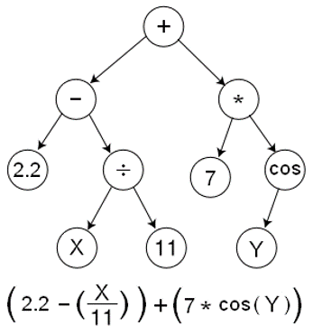
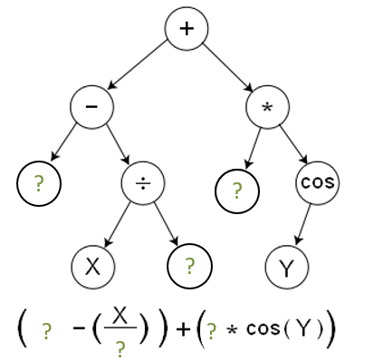

___
# Вопрос 10: Эволюционные алгоритмы. Определение. Различия между ЭА и ГА. Генетическое и эволюционное программирование.
___

## Классификация эволюционных алгоритмов

* Генетический алгоритм
* Генетическое программирование
* Эволюционная стратегия
* Дифференциальная эволюция
* Нейроэволюция

## Определение

Эволюционные алгоритмы - направление в искусственном интеллекте (раздел эволюционного моделирования), которое использует и моделирует процессы естественного отбора.

## Различия между ЭА и ГА

* Первое различие заключается в способе представления особей. Эволюционные алгоритмы оперируют векторами действительных чисел, тогда как генетические алгоритмы - двоичными векторами.

* Второе различие между генетическими и эволюционными алгоритмами кроется в организации процесса селекции. **В эволюционных алгоритмах применяется детерминированная процедура селекции, тогда как в генетических алгоритмах она имеет случайный характер.** При реализации эволюционного алгоритма формируется промежуточная популяция, состоящая из всех родителей и некоторого количества потомков, созданных в результате применения генетических операторов. С помощью селекции размер этой промежуточной популяции уменьшается до величины родительской популяции за счет исключения наименее приспособленных особей. Сформированная таким образом популяция образует очередное поколение. Напротив, в генетических алгоритмах предполагается, что в результате селекции из популяции родителей выбирается количество особей, равное размерности исходной популяции, при этом некоторые (наиболее приспособленные) особи могут выбираться многократно. В то же время, менее приспособленные особи также имеют возможность оказаться в новой популяции. Шансы их выбора пропорциональны величине приспособленности особей.

* Третье различие между эволюционными алгоритмами и генетическими алгоритмами касается последовательности выполнения процедур селекции и рекомбинации (т.е. изменения генов в результате применения генетических операторов). **При реализации эволюционных алгоритмов вначале производится рекомбинация, а потом селекция. В случае выполнения генетических алгоритмов эта последовательность инвертируется.** При осуществлении применении эволюционных алгоритмов потомок образуется в результате скрещивания двух родителей и мутации. Формируемая таким образом промежуточная популяция, состоящая из всех родителей и полученных от них потомков, в дальнейшем подвергается селекции, которая уменьшает размер этой популяции до размера исходной популяции. При выполнении генетических алгоритмов вначале производится селекция, приводящая к образованию переходной популяции, после чего генетические операторы скрещивания и мутации применяются к особям (выбираемым с вероятностью скрещивания) и к генам (выбираемым с вероятностью мутации).

* Четвертое различие между генетическими и эволюционными алгоритмами заключается в том, что параметры генетических алгоритмов (такие, как вероятности скрещивания и мутации) остаются постоянными на протяжении всего процесса эволюции, тогда как при реализации эволюционного алгоритма эти параметры подвергаются непрерывным изменениям (так называемая самоадаптация параметров).

## Генетическое и эволюционное программирование

### Генетическое программирование

Особи – это программы, параметры и структура которых заранее неизвестны. Основной задачей является автоматическое создание или изменение программ с помощью генетических алгоритмов. С помощью этой методологии «выращиваются» программы, всё лучше и лучше (в соответствии с определенной функцией приспособленности для хромосом) решающие поставленную вычислительную задачу.

В древовидном кодировании каждый узел дерева содержит функцию, а каждый лист — операнд. Выражение, представленное в виде дерева, может быть легко рекурсивно посчитано. Традиционное ГП легче использовать для выращивания программ, написанных на языках, естественным образом воплощающих древовидную структуру: Lisp, Haskell, F# и других функциональных языках программирования.

Недревовидные представления программ также были предложены и успешно реализованы, например, линейное генетическое программирование, подходящее для традиционных императивных языков.

Выбор способа кодирования программы в генетическом алгоритме — один из основных вопросов генетического программирования. Программа должна быть закодирована в таком виде, чтобы легко было автоматически вносить случайные изменения (оператор мутации) и объединять два алгоритма в один (оператор скрещивания).

Способы кодирования можно разделить на два класса:

* Прямое кодирование — генетический алгоритм работает с программой в явном виде.
* Косвенное кодирование — генетический алгоритм работает не с самим кодом программы, а с правилами его построения. То есть генетический алгоритм работает с программой, которая генерирует нужную нам программу.

### Эволюционное программирование

Похоже на генетическое программирование, но структура оптимизируемой программы является фиксированной, а ее числовые параметры могут изменяться.

В основе эволюционного программирования (автор Лоуренс Дж. Фогель, 1960 год) лежит идея представления альтернатив решения задачи в виде универсальных конечных автоматов, способных реагировать на стимулы, поступающие из окружающей среды. Эволюционное программирование было применено к решению различных прикладных задач, включая маршрутизацию трафика и планирование, выявление рака, военное планирование, обучение в играх, разработку систем управления, идентификации, обработки сигналов и т.д. Гипотезы о виде зависимости целевой функции от переменных формулируются системой в виде программ на некотором внутреннем языке программирования. Процесс построения таких программ строится как эволюция в мире программ. Если система находит программу, которая достаточно точно выражает искомую зависимость, она начинает вносить в нее небольшие модификации и отбирает среди построенных таким образом дочерних программ те, которые повышают точность. Система «выращивает» несколько генетических линий программ, конкурирующих между собой в точности нахождения искомой зависимости. Специальный транслирующий модуль, переводит найденные зависимости с внутреннего языка системы на понятный пользователю язык (математические формулы, таблицы и др.).