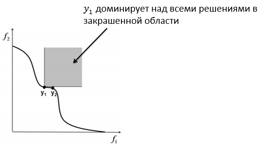

___
# Вопрос 12: Многокритериальная оптимизация. Понятие множества Парето, доминируемых и недоминируемых решений. Фронт Парето. 
___
Многокритериальная оптимизация – раздел теории оптимизации, рассматривающий задачи, в которых целевая функция – векторная величина. Эти задачи широко распространены во всех инженерных областях.

Многокритериальные задачи обычно не имеют однозначного решения в терминах классической теории оптимизации, так как глобальные минимумы различных компонентов векторной целевой функции не совпадают. В этом случае часто ставится задача найти не одно решение, а набор решений, определяющих наилучший компромисс между целевыми функциями. Задача многокритериальной оптимизации может быть записана в виде:

$${\vec{x^\text{\*}}} = arg min \vec{f}(\vec{x})$$

Введем понятие доминируемого и недоминируемого решений. Решение $x_1$ доминирует над решением $x_2$, т.е. $x_1 	\prec x_2$, если $f_i(x_1) \leq f_i(x_2) \forall i$. Недоминируемое решение $x_ND$ - такое, что любой из компонентов целевой функции 

$$f_i(x_ND)\leq f_i(x\*) \forall x\*$$

где $x$ - одно из решений.

Один из способов решения задачи многокритериальной оптимизации – нахождение решения в виде множества Парето. Множество Парето $\mathcal{P}$ - это набор недоминируемых решений. Образ множества Парето в пространстве значений целевых функций называется фронтом Парето $\mathcal{F} = {y = f(x); x \in \mathcal{P}$

*(**Определение из алгебры:** Пусть задано отображение $f:E \to F$  и множество $D \subset E$. Множество элементов из $F$, каждый из которых является **образом** хотя бы одного элемента из D при отображении f, называется образом множества D и обозначается f(D). Т.е. **Образ множества - это множество элементов, которые являются образами других элементов при отображении**.)*

Графическим изображением множества Парето, или множества недомирируемых решений, является фронт Парето. Пусть многокритериальная оптимизация производится по двум функциям f_1 и f_2. Тогда линия, соответствующая всем недомирируемым решениям, будет являться фронтом Парето.