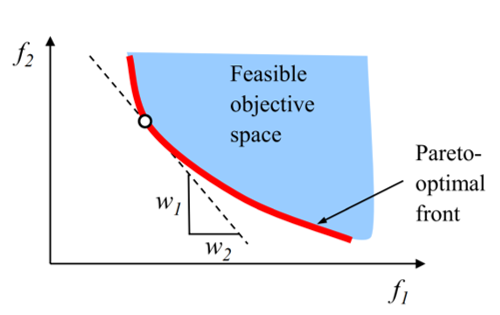
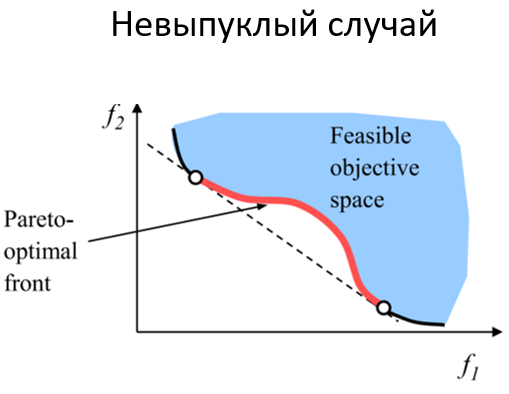
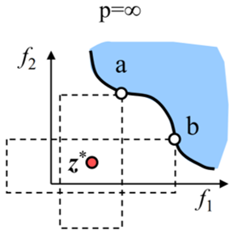
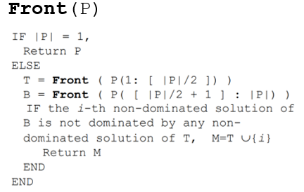
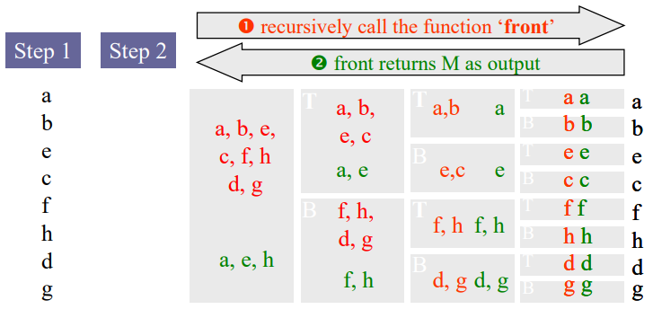
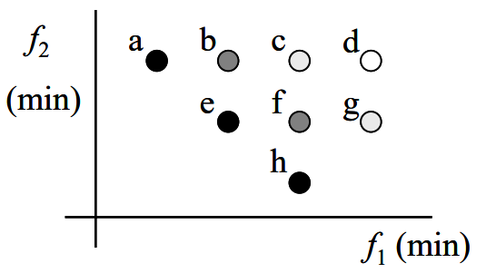
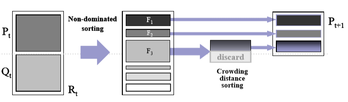
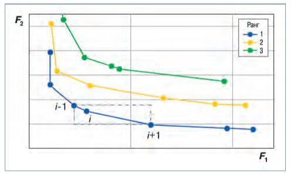
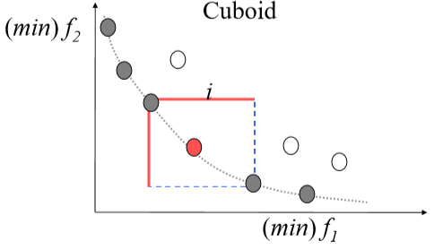
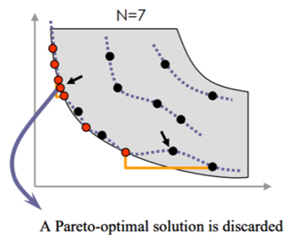

___
# Вопрос 13: Многокритериальная оптимизация. Метод взвешенной суммы. Метод взвешенной метрики. Генетические алгоритмы.
___

## Зависимые вопросы

* [Вопрос 12: Многокритериальная оптимизация. Понятие множества Парето, доминируемых и недоминируемых решений. Фронт Парето.](tickets/12.md)
* [Вопрос 5: Генетический алгоритм. Определение. Общая схема. Понятие хромосомы, гена, отбора.](5.md)
* [Вопрос 6: Виды кроссовера в генетическом алгоритме.](6.md)
* [Вопрос 8: Бинарное и вещественное кодирование в генетическом алгоритме. Код Грея.](8.md)
* [Вопрос 9: Понятие элитизма. Алгоритм островов. Клеточный ГА.](9.md)

Для получения оптимальных по Парето решений часто используют методы скаляризации. Поскольку целевая функция задачи многокритериальной оптимизации имеет векторные значения, ее превращают в функцию со скалярным значением. Таким образом, задача многокритериальной оптимизации сводится к задаче оптимизации с одной скалярной целевой функцией. Функция скаляризации должна удовлетворять следующим условиям.

Пусть $$F$$ - функция скаляризации, которая превращает векторную функцию $$\vec{y} = \vec{f}(\vec{x})$$ в скалярную. Если $$F$$ сохраняет упорядоченность по Парето, то есть, если для произвольных $$\vec{y^{1}}, \vec{y^{2}} \in \vec{f}(X)$$ выполняется:

$$\vec{y^{1}} \leq \vec{y^{2}} \Rightarrow F(\vec{y^{1}}) < F(\vec{y^{2}})$$,

тогда решение, что минимизирует $$F$$ на $$X$$ является решением по Парето.
Если же 

$$\vec{y^{1}} < \vec{y^{2}} \Rightarrow F(\vec{y^{1}}) < F(\vec{y^{2}})$$,

тогда решение, что минимизирует $$F$$ на $$X$$ является слабым по Парето. Если $$F$$  непрерывна и $$\vec{x^{0}}$$ единственная точка минимума $$F$$ на $$X$$, тогда  $$\vec{x^{0}}$$ является решением по Парето.

**Метод взвешенной суммы**

Это один из методов скаляризации. Суть метода:

 Целевая функция скаляризуется путем назначения весовых коэффициентов значения $$w_m$$ каждого из компонент решения $$f_m$$. 

$$F(x) = \sum_{ m = 1}^{M}w_mf_m(x)$$

Достоинство метода заключается в его простоте. Недостатки:

* Нужна настройка весов;
* Нельзя найти оптимальное по Парето решение, если пространство целевой функции не выпуклое.

**Метод взвешенной метрики**

Ещё один способ скаляризации функции. Суть метода:

Целевая функция – это комбинация взвешенных расстояний до некоторого идеального решения $$z^{*}$$.

$$l_p(x) = (\sum_{m = 1}^{M}w_m{|f_m(x) - {z_m}^{*}}|^p)^{1/p}$$

Достоинство: Метод по метрике Чебышева гарантирует нахождение всех Парето-оптимальных решений вблизи $$z^{*}$$.

Недостатки:
* Нужно априори знать $$z^{*}$$
* Нужно знать границы значений ЦФ
* При больших p задача становится недифференцируемой

**Генетические алгоритмы**

В то время как традиционные алгоритмы оперируют с одним из возможных решений, генетический алгоритм оперует с множеством решений, что является преимуществом в рамках многокритериальной оптимизации.

*1. Метод Кунга*

Ш1. Отсортируем популяцию в порядке убывания важности первой целевой функции и назовём популяцию $$P$$.
Ш2. Вызвать рекурсивную функцию Front(P).

Иллюстрация работы алгоритма:

Пример результата работы алгоритма:

Достоинство: наиболее эффективный вычислительный алгоритм из известных.??

*2. Элитарная недоминируемая сортировка*

Общая схема:

1. Объединяем решения в несколько взаимоисключающих недоминируемых множеств.

Определение расстояния скопления (crowding distance)
Задаётся половина периметра кубоида, отбираются входящие в него решения с ближайшими соседними решениями на том же фронте.

2. Недоминируемый отбор

Каждое решение имее ранг недоминирования и групповую дистанцию
Решение $$i$$ побеждает решение j, если:
* Решение  i имеет лучший ранг;
* При равном ранге групповая дистанция i меньше.

*Пошагово алгоритм:*

**Ш1:**

* Объединить потомства родителей $$P_t$$ и потомства $$Q_t$$: $$R_t = P_t \cong Q_t$$;
* Выполнить недоминируемую сортировку по $$R_t$$ и найти разные фронты $$F_i$$.

**Ш2:** 

Установить: $$P_{t+1} = \varnothing$$  и $$i=1$$.

Пока $$|P_{t+1}| + |F_i| < N$$: $$P_{t+1} = P_{t+1} \cong F_i$$, увеличить $$i$$.

**Ш3:** 

Включить наиболее широко распространённые решения $$F_i$$ - $$N-|P_{t+1}|$$ в $$P_{t+1}$$ используя crowding distance.

**Ш4:** Создать популяцию $$Q_{t+1}$$  из $$P_{t+1}$$ используя турнирный отбор, кроссовер и мутации.

**Достоинства:**

* Многообразие в популяции не нужно искусственно поддерживать благодаря групповому отбору;
* Элитизм защищает найденные лучшие решения от исчезновения.

**Недостаток:**Число оптимальных решений на фронте Парето фиксированное, некоторые решения могут потеряться.

