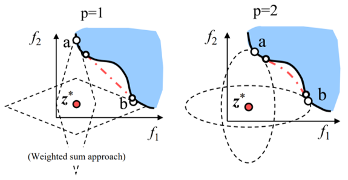

___
# Вопрос 13: Многокритериальная оптимизация. Метод взвешенной суммы. Метод взвешенной метрики. Генетические алгоритмы.
___

**Метод взвешенной метрики**

Суть метода:

 Целевая функция скаляризуется путем назначения весовых коэффициентов значения $$w_m$$ каждого из компонент решения $$f_m$$

$$F(x) = \sum_{ m = 1}^{M}w_mf_m(x)$$

Достоинство метода заключается в его простоте. Недостатки:

* Нужна настройка весов;
* Нельзя найти оптимальное по Парето решение, если пространство целевой функции не выпуклое.

**Метод взвешенной метрики**

Суть метода:

Целевая функция – это комбинация взвешенных расстояний до некоторого идеального решения $$z^{*}$$.

$$l_p(x) = (\sum_{m = 1}^{M}w_m{|f_m(x) - {z_m}^{*}}^p\)^{1/p}$$

Достоинство: Метод по метрике Чебышева гарантирует нахождение всех Парето-оптимальных решений вблизи $$z^{*}$$.

Недостатки:
* Нужно априори знать $$z^{*}$$
* Нужно знать границы значений ЦФ
* При больших p задача становится недифференцируемой
