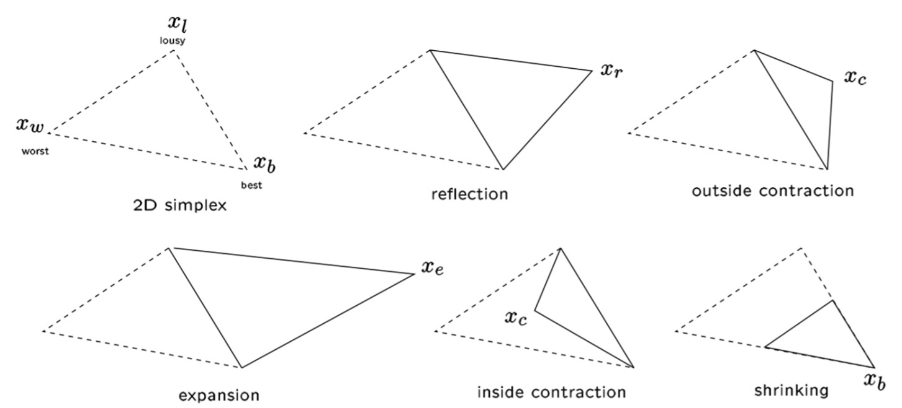
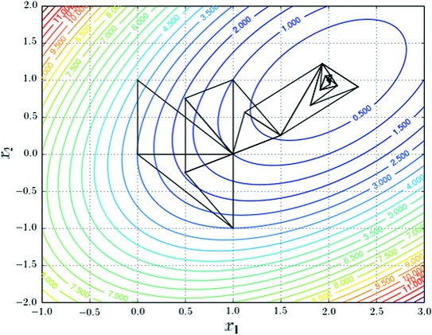

___
# Вопрос 14: Метод симплексов
___

Метод безусловной оптимизации функции от нескольких переменных, не использующий градиентов функции. Суть метода заключается в последовательном перемещении и деформировании симплекса вокруг точки экстремума.

Симплекс – n-мерное обобщение треугольника:

Операции над симплексами

## Алгоритм
Параметры метода:
коэффициент отражения $$\alpha$$ > 0, обычно выбирается равным 1.
коэффициент сжатия $$\beta$$ > 0, обычно выбирается равным 0,5.
коэффициент растяжения $$\gamma$$ > 0, обычно выбирается равным 2.

Пусть требуется найти безусловный минимум функции 2 переменных. Тогда симплекс будет иметь размерность равную 3.

### Шаг 1 - обозначение точек
Выберем три точки – вершины треугольника. Вычислим значения целевой функции в вершинах и обозначим их как best, lousy и worst: $$f_b$$, $$f_l$$, $$f_w$$. Соответствующие точки пространства обозначим как $$x_b, x_l, x_w$$.

### Шаг 2 - отражение
Найдем среднее арифметическое всех точек симплекса, кроме худшей $$x_w$$: 
$$
x_a=\frac{1}{n}\sum_{i=0,i\neq w}^{n+1}x_i
$$
Для нашего случая формула будет выглядеть следующим образом: 
$$
x_a = (\frac{x_l+x_b}{2}; \frac{y_l+y_b}{2})
$$
Найдем отражение худшей точки и вычислим значение функции в этой точке $$f_r = f(x_r)$$: 
$$
x_r = x_a + \alpha(x_a-x_w)
$$

### Шаг 3 - смотрим какое место между всеми точками заняла отраженная точка
Если $$f_r < f_b$$, то направление удачное и можно увеличить шаг: найдем "растяжение" и вычислим значение функции в этой точке $$f_e=f(x_e)$$: 
$$
x_e=x_r+\gamma(x_r-x_a)
$$

Если $$f_e<f_r$$, то $$x_w = x_e$$ и переходим на Шаг 6.
Если $$f_r<f_e$$, то $$x_w = x_r$$ и переходим на Шаг 6.
Если $$f_r < f_l$$, то $$x_w = x_r$$ и переходим на Шаг 6.
Если $$f_r > f_w$$, то на Шаг 4.
Если $$f_r < f_w$$, то на Шаг 5.

### Шаг 4 - внутреннее сжатие
Используя среднюю точку $$x_a$$ и худшую точку $$x_w$$, найдем $$x_c$$  и значение функции в этой точке $$f_c = f(x_c)$$: 
$$
x_c = x_a - \beta(x_a-x_w)
$$
Если $$f_c < f_w$$, то $$x_w = x_c$$  и переходим к Шагу 6.
Иначе проводим "сокращение" - обновляем все вершины, кроме лучшей по следующему соотношению:
$$
x_i = x_b + \rho(x_i-x_b)
$$ 
и переходим к Шагу 6.

### Шаг 5 - внешнее сжатие
Используя среднюю точку $$x_a$$ и худшую точку $$x_w$$, найдем $$x_o$$  и значение функции в этой точке $$f_o = f(x_o)$$: 
$$
x_o = x_a + \beta(x_a-x_w)
$$
Если $$f_o < f_r$$, то $$x_w = x_o$$  и переходим к Шагу 6.
Иначе проводим "сокращение" - обновляем все вершины, кроме лучшей по следующему соотношению:  
$$
x_i = x_b + \rho(x_i-x_b)
$$ 
и переходим к Шагу 6.

### Шаг 6 - проверка сходимости
Если алгоритм сходится или достигнут критерий остановки, заканчиваем работу.
Иначе проводим переоценку точек: находим значения функций в этих точках и обозначаем их как best, lousy и worst ($$x_b, x_l, x_w$$) и переходим к Шагу 2.

## Пример выполнения метода

