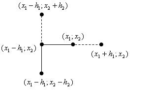

 ___

# Вопрос 15: Метод Хука-Дживса.

___

[Онлайн решение методом Хукка-Дживса](https://math.semestr.ru/optim/hook-jeeves.php)
[Практика](4_practise.md)

Метод Хука — Дживса служит для поиска безусловного локального экстремума функции и относится к прямым методам, то есть опирается непосредственно на значения функции. Алгоритм делится на две фазы: исследующий поиск и поиск по образцу.

### Подготовка

Необходимо задать стартовую точку, начальный шаг, точность, параметр для шага по образцу:
* $$\overline{x}_{1}$$ = ($$x_1$$; $$x_2$$) = [3; 1];
* h = 1. Можно взять разные шаги для каждой из осей - это одна из модификаций алгоритма; 
* T = 0.5;
* $$\lambda$$ = 2.

### Исследующий поиск 

Вычисляем значения функции в точках $$x_1 + h$$ и $$x_1 - h$$ (где $$x_1$$ — первая координата точки, а $$h$$ — соответственно значение шага по этой координате) и переходим в точку с наименьшим значением функции. В этой точке замораживаем значения всех координат кроме 2-й, вычисляем значения функции в точках $$x_2 + h$$ и $$x_2 - h$$, переходим в точку с наименьшим значением функции и т. д. для всех координат. В случае, если для какой-нибудь координаты значение в исходной точке меньше, чем значения для обоих направлений шага, то шаг по этой координате уменьшается. Когда шаги по всем координатам $$h$$ станут меньше соответствующих значений T, алгоритм завершается, и точка $$\overline{x_1}$$ признаётся точкой минимума. Иллюстрация исследующего поиска:

### Поиск по образцу

На этапе поиска по образцу откладывается точка 3 в направлении от 1 к 2 на том же расстоянии. Её координаты получаются по формуле $${\displaystyle {\overline {x}}_{3}={\overline {x}}_{1}+\lambda ({\overline {x}}_{2}-{\overline {x}}_{1})}$$, где $$x_i$$ — точка с номером i, λ — параметр алгоритм. Затем в новой точке 3 проводится исследующий поиск, как на 1 фазе алгоритма, за исключением того, что шаг на этой фазе не уменьшается. Если на этой фазе в результате исследующего поиска удалось получить точку 4, отличную от точки 3, то точку 2 переобозначим на 1, а 4 на 2 и повторим поиск по образцу. В случае если не удаётся найти точку 4, отличную от точки 3, то точку 2 переобозначим на точку 1 и повторим 1-ю фазу алгоритма — исследующий поиск. Иллюстрация:

