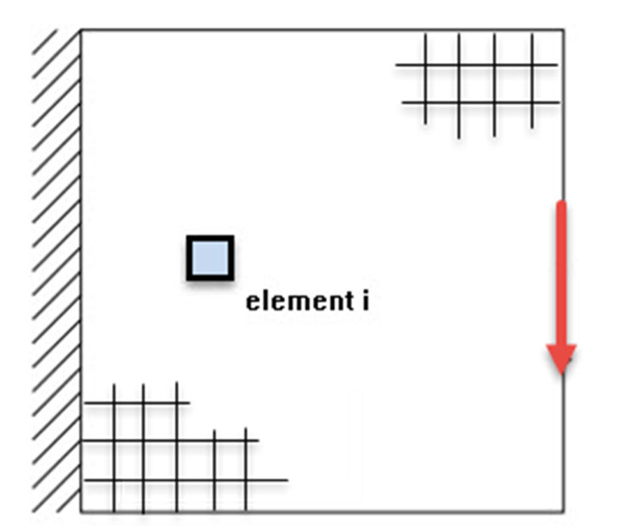
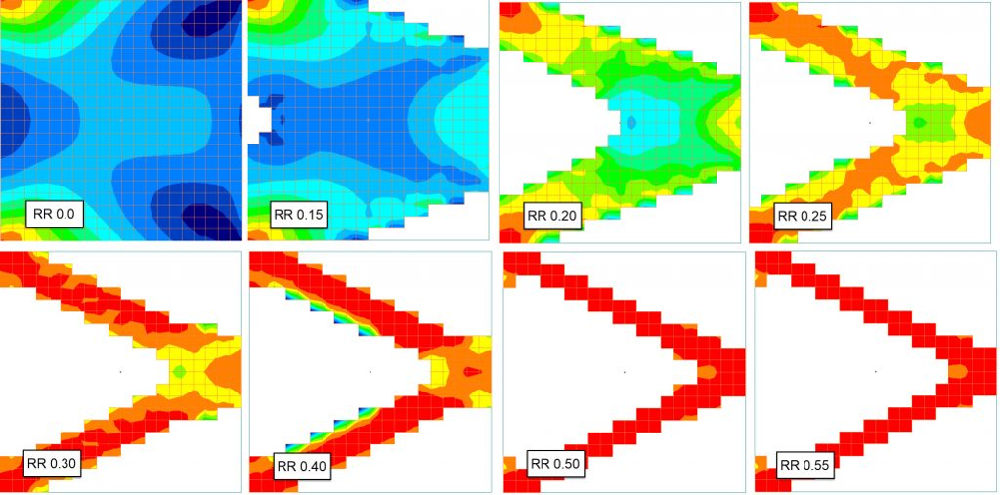
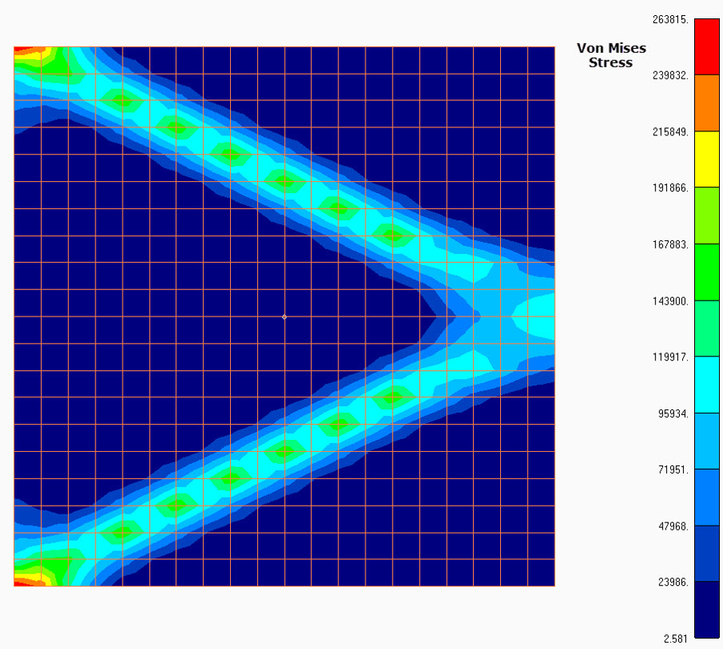
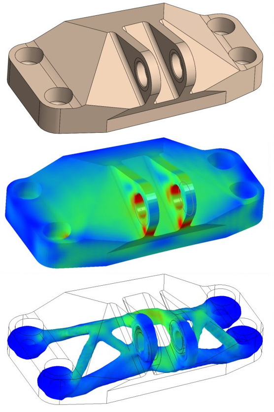
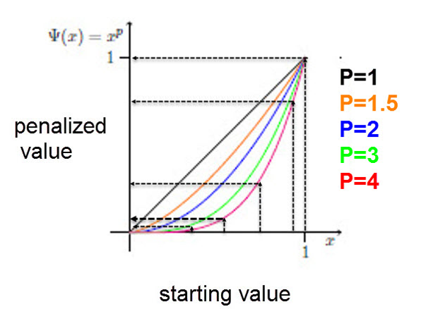
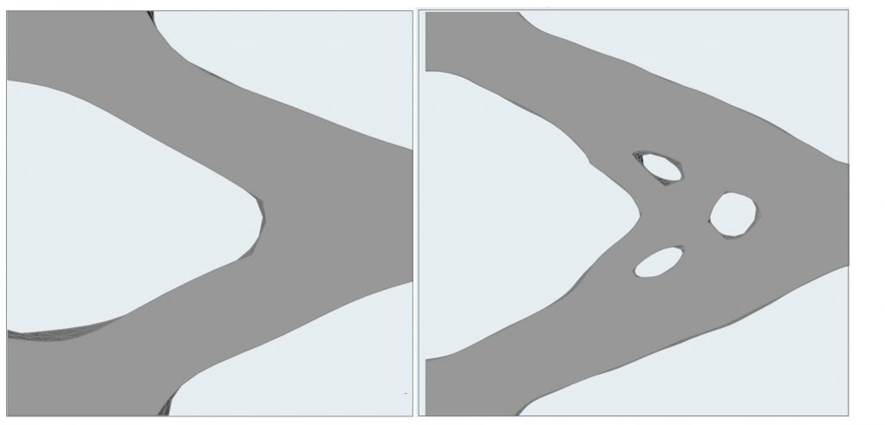
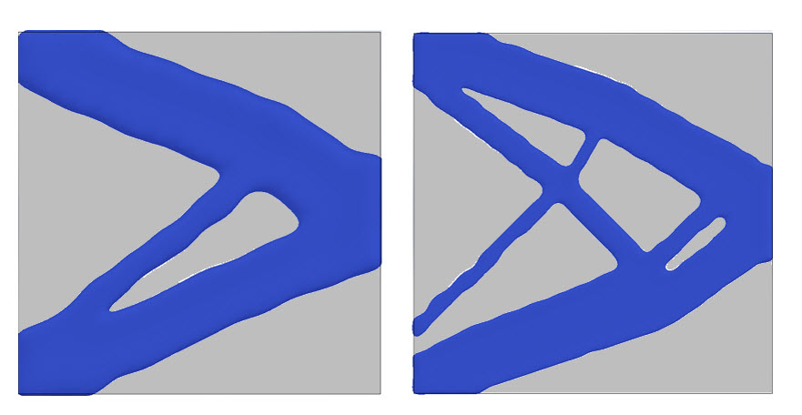
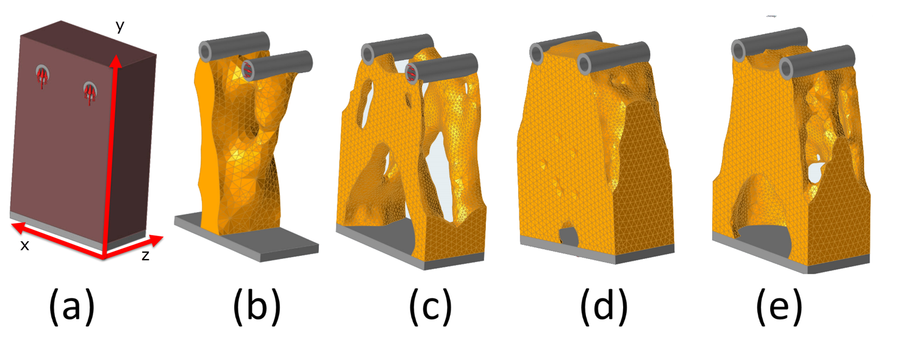

___
# Вопрос 4: Топологическая оптимизация. Понятие, область применения. Методы ESO, BESO, SIMP, Level-Set method. Ограничения при использовании топологической оптимизации.
___

### Топологическая оптимизация. Понятие, область применения

**Топологическая оптимизация (ТО)** – это оптимизация распределения материала в проектной области при воздействии на нее заданных нагрузок и использовании ограничений различного рода:  геометрических, прочностных, жесткостных и др. ТО является видом оптимизации формы конструкции, иногда именуемой оптимизацией компоновки.

### Метод ESO (Evolutionary Structural Optimization)

Метод ESO основан на определении уровня напряжений в произвольной части конструкции методом конечных элементов. Индикатором неэффективного использования материала является низкий уровень напряжений (или деформаций) в той или иной части конструкции.
В идеале уровень напряжений в конструкции должен быть одинаковым, близким к предельному, но безопасному значению.
Из этой концепции следует принцип удаления материала, согласно которому недостаточно нагруженный материал может быть удален, что приводит к удалению отдельных элементов конечно-элементной модели.

**Критерий отбраковки** - относительный уровень напряжения не превышает порог отбраковки

Уровень напряженности каждого элемента определяется сравнением, например напряжений Мизеса этого элемента $$ \sigma_{e}^{vm} $$, с критическим или максимальным значением напряжений Мизеса в конструкции $$ \sigma_{max}^{vm} $$
Если в результате конечно-элементного анализа элемент удовлетворяет условию:
$$
x = \frac{\sigma_{e}^{vm}}{\sigma_{max}^{vm}} < R_{Ri}
$$

где $$ R_{R} $$ - предельное значение (коэффициент отбраковки), при котором элемент удаляется.

Напряжения считаются методом конечных элементов.

**Пример оптимизации: консольная рама**

**Недостаток:** Удаленный на ранних итерациях материал может быть ползен на последующих, но метод ESO не позволяет восстановить его. Т.о. в ряде случаев он не позволяет получить оптимального решения.

### Метод BESO (Bi-directional Evolutionary Structural Optimization)

Метод BESO (или метод двунаправленной эволюционной оптимизации конструкций) позволяет одновременно удалять и добавлять материал в области проектирования. Принципиальное отличие данного метода от ESO заключается в том, что индекс чувствительности пустых элементов определяется путем линейной экстраполяции поля смещений, получаемого в результате конечно-элементного анализа. После этого заполненные элементы с минимаотными значениями индексами чувствительности заполняются удаляются из структуры, а пустые элементы с наибольшими значениями чувствительности заполняются материалом.

**Пример:**

### Метод SIMP (Solid Isotropic Material with Penalization)

SIMP-метод или метод пенализации для твердого изотропного тела - это метод ТО, основополагающая идея которого заключается в создании поля виртуальной плотности, представляющей аналог некоторой реальной характеристики объекта. Назначение метода состоит в уменьшении податливости конструкции вследствие перераспределения материала в рассматриваемой области пространства при известных граничных условиях. Результатом его использования является получение разнопрочного объекта в рамках рассматриваемой задачи.

Идея метода:
Объект имеет области разной виртуальной плотности, от 0 (пустота) до 1 (материал).
Дробная плотность не имеет физического смысла и штрафуется с помощью функции P.

**Penalization Function**

**Пример оптимизации консоли:**

### Level-Set-метод

Основная идея метода Level-Set (установления уровня или множества уровней) состоит в том, чтобы выразить кривую или поверхность в неявном виде. При этом они принимаются в качестве установленного нулевого уровня многомерной функции. Затем прослеживается их деформация с помощью этой функции.

Для заданной области с гладкой границей предполагается существование неявной функции «топологической чувствительности» - чем она больше, тем большее влияние будет иметь удаление текущего элемента.

$$
\varphi(x) = \begin{cases}
   >0, x \in \varOmega^{+} \text{(материал)} \\
   =0, x \in \partial\varOmega \text{(граница)} \\
   <0, x \in \varOmega^{-} \text{(пустота)}
\end{cases}
$$

**Пример оптимизации консоли:**

### Ограничения при использовании топологической оптимизации.

* Типы нагрузки

(a) пространство оптимизации, (b) осевая нагрузка, (c) сгибающая нагрузка, (d) скручивающая нагрузка, (e) комбинированная нагрузка

* Геометрические
* Прочностные
* Жесткостные
* Производственные ограничения
и т.д.