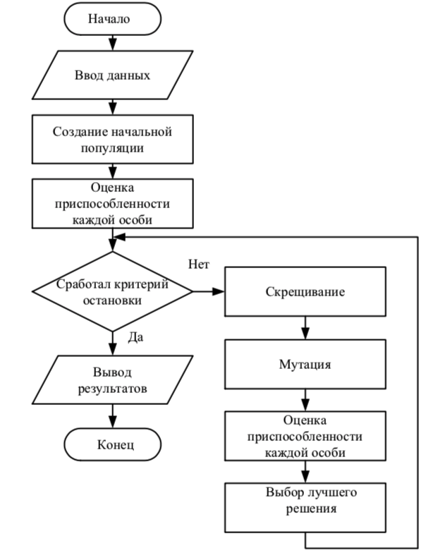
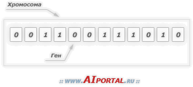
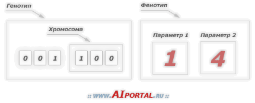

 ___

# Вопрос 5: Генетический алгоритм. Определение. Общая схема. Понятие хромосомы, гена, отбора.

___

### Зависимые вопросы

* [Виды кроссовера в генетическом алгоритме](6.md)
* [Виды селекции в генетическом алгоритме](7.md)
* [Практика с бинарным кодированием](1_practise.md)
* [Практика c вещественным кодированием](2_practise.md)

### Определение

Генетический алгоритм (ГА) - это эвристический алгоритм поиска, используемый для решения задач оптимизации и моделирования путём случайного подбора, комбинирования и вариации искомых параметров с использованием механизмов, аналогичных естественному отбору в природе.

### Общая схема

### Основные понятия ГА

_Популяция_ – это конечное множество _особей_. Особи, входящие в популяцию, в генетических алгоритмах представляются хромосомами с закодированным в них множествами параметров задачи, т.е. решений, которые иначе называются точками в пространстве поиска.

_Хромосомы_ (другие названия – цепочки или кодовые последовательности) – это упорядоченные последовательности генов.

_Ген_ (также называемый свойством, знаком или детектором) – это атомарный элемент генотипа, в частности, хромосомы.

Иллюстрация понятия гена и хромосомы:

### Отбор

Стратегии формирования нового поколения. Существует 2 основных типа формирования нового поколения после кроссовера и мутации:

* дети замещают родителей;
* новое поколение составляется из совокупности и детей, и их родителей.

_Ранговый отбор_. Для каждой особи её вероятность попасть в промежуточную популяцию пропорциональна её порядковому номеру в отсортированной по возрастанию приспособленности популяции. Такой вид отбора не зависит от средней приспособленности популяции.

_Элитарный отбор_: в новое поколение включается заданное количество лучших особей предыдущего поколения. Иногда этот метод комбинируют с другими. Использование стратегии элитизма не допускает потери лучших решений. К примеру, если популяция сошлась в локальном максимуме, а мутация вывела одну из строк в область глобального, то при замещении родителей весьма вероятно, что эта особь в результате скрещивания будет потеряна и решение задачи не будет получено. Если же используется элитизм, то полученное хорошее решение будет оставаться в популяции до тех пор, пока не будет найдено лучшее.

_Отбор вытеснением_. В данном типе отбора выбор особи в новую популяцию зависит не только от степени её пригодности, но и от того, есть ли уже в формируемой популяции особь с аналогичным набором хромосом. Отбор проводится из числа родителей и их потомков. Таким образом, не теряются лучшие решения и постоянно поддерживается разнообразие, что увеличивает привлекательность этого метода в многоэкстремальных задачах.

___

Все что идет дальше не описано в лекциях. Привел их для понимания сути алгоритма.

_Генотип_ или _структура_ – это набор хромосом данной особи. Следовательно, особями популяции могут быть генотипы либо единичные хромосомы (в довольно распространенном случае, когда генотип состоит из одной хромосомы).

_Фенотип_ – это набор значений, соответствующих данному генотипу, т.е. декодированная структура или множество параметров задачи (решение, точка пространства поиска).

Каждая хромосома может кодировать только один параметр задачи. Но так как в одном генотипе может быть несколько хромосом, то один генотип может закодировать несколько параметров. Например: генотип включает в себя две хромосомы, каждая хромосома состоит из 3 генов, значит, первые 3 гена генотипа кодируют один параметр, а вторые 3 гена – второй параметр. Иллюстрация пример генотипа и фенотипа:

