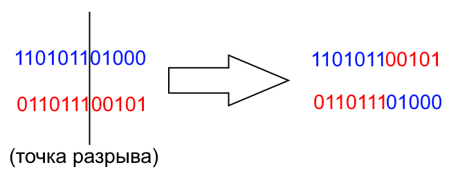
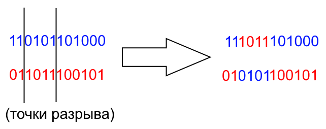
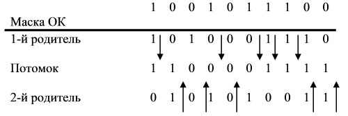

___
# Вопрос 6: Виды кроссовера в генетическом алгоритме.
___

## Одноточечный кроссинговер

Случайным образом определяется точка внутри хромосомы (crossover point), в которой обе хромосомы делятся на две части и обмениваются ими.

## Двухточечный кроссинговер

В 2-х точечном кроссинговере точек разрыва 2.

## N-точечный кроссинговер

Является обобщением 1- и 2-точечного кроссинговеров, но для n > 2.

## Однородный кроссинговер

Кроме описанных типов кроссинговера есть ещё однородный кроссинговер. Его особенность заключается в том, что значение каждого бита в хромосоме потомка определяется случаным образом из соответствующих битов родителей. Для этого вводится некоторая величина $$ 0 < p_{0} < 1 $$, и если случайное число больше p0, то на n-ю позицию первого потомка попадает n-й бит первого родителя, а на n-ю позицию второго - n-й бит второго родителя. В противном случае к первому потомку попадает бит второго родителя, а ко второму - первого. Такая операция проводится для всех битов хромосомы.