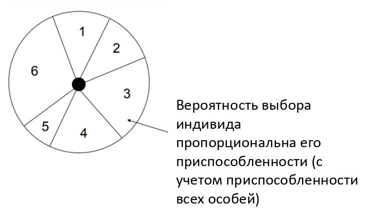
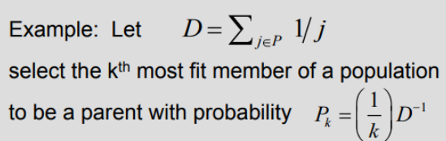
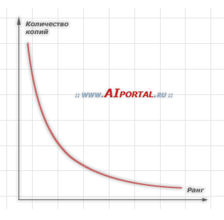

___
# Вопрос 7: Виды селекции в генетическом алгоритме.
___

## Зависимые вопросы
* [Вопрос 5: Генетический алгоритм. Определение. Общая схема. Понятие хромосомы, гена, отбора.](5.md)
* [Вопрос 6: Виды кроссовера в генетическом алгоритме.](6.md)
* [Вопрос 8: Бинарное и вещественное кодирование в генетическом алгоритме. Код Грея.](8.md)
* [Вопрос 9: Понятие элитизма. Алгоритм островов. Клеточный ГА.](9.md)

## Определения

**Селекция** - это оператор, посредством которого индивиды (т.е. хромосомы) выбираются для спаривания и порождения потомков.

Для имитации естественной селекции индивиды с более высокой пригодностью должны выбираться с большей вероятностью.

Существует большое число различных моделей селекции, некоторые из которых не имеют биологических аналогов.

Большинство схем селекций, используемых в ГА, создают промежуточную популяцию и затем выбирают из нее случайным образом пары индивидов для скрещивания.

Предположения:
* Мера Q качества решения (целевая функция) задачи известна.
* Она должна быть максимизирована.
* Она должна быть всегда положительной.
* Мы рассматриваем меру Q качества индивида как его пригодность.

## Рулеточная селекция
**Рулеточный отбор** - метод селекции считается для генетических алгоритмов основным методом отбора особей для родительской популяции с целью последующего их преобразования генетическими операторами, такими как скрещивание и мутация.

Несмотря на случайный характер процедуры селекции, родительские особи выбираются пропорционально значениям их функций приспособленности:
> каждой хромосоме сопоставлен сектор колеса рулетки, величина которого устанавливается пропорциональной значению функции приспособленности данной хромосомы, поэтому, чем больше значение функции приспособленности, тем больше сектор на колесе рулетки.

Из такого метода вытекает следующее:
> чем больше сектор на колесе рулетки, тем выше шанс, что будет выбрана именно эта хромосома.

Слабая сторона этого метода заключается в том, что особи с очень малым значением функции приспособленности слишком быстро исключаются из популяции, что может привести к преждевременной сходимости генетического алгоритма.

## Пропорциональная селекция

$$ f_{i} $$ - пригодность индивида $$ i $$

$$ \overline {f}={\frac  {1}{N}}*\sum _{i}f_{i} $$ - средняя пригодность популяции.

Два условия выбора индивида $$ i $$:
* большая вероятность $$ p_{i}={\frac  {f_{i}}{\sum _{j}f_{j}}}={\frac  {f_{i}}{\overline {f}*N}} $$.
* выбирать случайное вещественное число $$ r \in \left[0,\sum_{j=1}^{N}f_{j}\right] $$ и отобрать того индивида, для которого $$ \sum _{j=1}^{i-1}f_{j}\leq r<\sum _{j=1}^{i}f_{j}, \text{где} \sum _{j=1}^{0}f_{j}=0 $$.

Проблема: такой алгоритм работает относительно медленно.

В равновесном ГА популяциям не разрешается увеличиваться или сокращаться, поэтому для репродукции отбирают $$ N $$ индивидов. Отсюда следует, что ожидаемое число копий каждого индивида в промежуточной популяции равно $$ N_{i}=p_{i}*N={\frac  {f_{i}}{\overline {f}}} $$.

$$ N_{i} $$ обычно является вещественным числом. Реальное число копий (целое) может варьироваться около $$ N_{i} $$.

Индивиды с пригодностью выше средней имеют более одной копии в промежуточной популяции, а индивиды ниже средней пригодности могут не иметь ни одной (в среднем).

Проблемы с пропорциональной селекцией:
1. Преждевременная сходимость:
    * Индивид с $$ f_{i}>>\overline{f}, \text{но} f_{i}<<f_{max} $$ был получен на ранних поколениях.
    * Так как $$ N_{i}>>1 $$, гены такого индивида довольно быстро распространятся на всю популяцию.
    * В таком случае рекомбинация не может более производить новых индивидов (только мутация может) и $$ \overline {f}<<f_{max} $$ навсегда.
2. Стагнация:
    * Ближе к концу работы алгоритма все индивиды могут получить относительно высокую и примерно равную пригодность, т.е. $$ \forall if_{i} \approx f_{max} $$.
    * Тогда $$ N_{1}\approx \text{ ...} \approx N_{N}\approx 1 $$, что приводит к очень маленькому селективному давлению, т.е. наилучшее решение предпочитается лишь немного больше, чем наихудшее.

## Ранговая селекция

1. Индивиды сортируются (ранжируются) на основе их пригодности таким образом, чтобы $$ f_{i}\geq f_{j} \text{ для } i>j $$.
2. Затем каждому индивиду назначается вероятность $$ p_{i} $$ быть отобранным, взятая из заданного распределения с ограничением $$ \sum _{i}p_{i}=1 $$.

Типичные распределения:
* Линейное: $$ p_{i} = a * i + b(a < 0) $$.
* Отрицательное экспоненциальное: $$ p_{i} = a * exp(b * i + c) $$. Это эквивалентно назначению первому индивиду вероятности p, второму - $$ p_{2} $$, третьему - $$ p_{3} $$, и т.д.

Преимущества:
* Нет преждевременной сходимости, т.к. нет индивидов с $$ N_{i}>>1 $$.
* Нет стагнации, так как и к концу работы алгоритма $$ N1\neq N2\neq \text{ .... } $$.
* Нет необходимости в явном вычислении пригодности, т.к. для упорядочения индивидов достаточно иметь возможность их попарного сравнения.
* Возможность применения как для максимизации, так и для минимизации функции.

Недостатки:
* Значительные накладные расходы на переупорядочивание.
* Трудность теоретического анализа сходимости.

График зависимости количества копий особей в популяции от ранга каждой особи:

## Турнирная селекция
Для отбора индивида создается группа из $$ N(N\geq 2) $$ индивидов, выбранных случайным образом

Индивид с наибольшей пригодностью в группе отбирается, остальные - отбрасываются (турнир)

Турнирную селекцию можно рассматривать как ранговую селекцию при наличии шума.

Преимущества:
* Нет преждевременной сходимости
* Нет стагнации
* Не требуется глобальное переупорядочивание
* Не требуется явное вычисление функции пригодности

## Элитарная селекция

[Разбирается в вопросе 9: Понятие элитизма. Алгоритм островов. Клеточный ГА.](9.md)

Как минимум одна копия лучшего индивида популяции всегда проходит в следующее поколение.

Преимущество: гарантия сходимости, т.е. если глобальный максимум будет обнаружен, то ГА сойдется к этому максимуму

Недостаток: большой риск захвата локальным минимумом

Альтернатива: сохранять лучшую найденную структуру в специальной ячейке памяти и в конце эксперимента использовать ее в качестве решения вместо лучшего в последнем поколении.