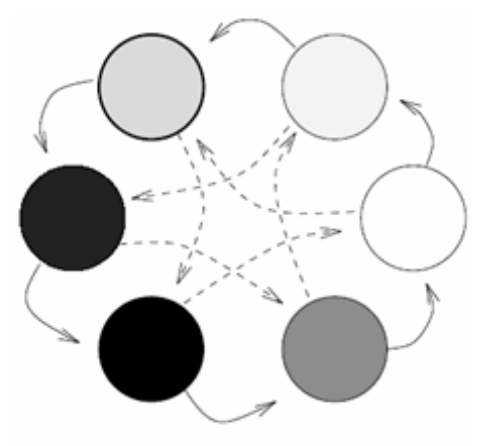

___
# Вопрос 9: Понятие элитизма. Алгоритм островов. Клеточный ГА.
___

Стратегия элитизма - это стратегия, при которой несколько лучших индивидуумов переходят в следующее поколение без изменений, не участвуя в кроссовере и отборе. В любом случае каждое следующее поколение будет в среднем лучше предыдущего. Когда приспособленность индивидуумов перестает заметно увеличиваться, процесс останавливают и в качестве решения задачи оптимизации берут наилучшего из найденных индивидуумов.

## Алгоритм островов

Эта модель является одной из разновидностей параллельных генетических алгоритмов, однако кроме распределения вычислительной нагрузки она часто применяется для решения задач, для которых характерна многоэкстремальность функции приспособленности.

Принцип работы стандартной островной модели заключается в том, что вместо одной большой популяции используется набор популяций меньшего размера. Эти популяции развиваются независимо, и только изредка происходит обмен представителями между популяциями.

Так как чаще всего число особей, содержащихся в островных популяциях невелико, то такие подпопуляции склонны к преждевременной сходимости. Поэтому важно правильно установить частоту миграции. Чересчур частая миграция или миграция слишком большого числа особей приведет к смешению всех подпопуляций, тогда островная модель будет несильно отличаться от обычного ГА. Если же миграция будет слишком редкой, то она не сможет предотвратить преждевременного схождения подпопуляций. Также заметим, что иногда при миграции производится мутация или какая-либо иная модификация перемещаемых особей.

Генетические алгоритмы стохастичны, поэтому при разных его запусках популяция может сходиться к разным решениям. Островная модель позволяет запустить алгоритм сразу несколько раз и пытаться совмещать «достижения» разных островов для получения в одной из подпопуляций наилучшего решения. Использование островной генетической модели позволяет во многих случаях избежать локальных минимумов, что положительно сказывается на сходимости к решению. Заметим, что при этом зачастую время работы генератора несколько больше, чем у стандартной модели, в силу того, происходит дупликация генерации решений.

## Клеточный ГА

Клеточная модель:

Зависимость размера популяций от количество вычислений функции:

Эта модель представляет собой вариацию островной модели. На этапе инициализации строится двумерная сетка. В каждой ячейке сетки  содержится особь, при этом определяется процесс взаимодействия между ячейками:
* каждая ячейка может взаимодействовать только с четырьмя своими соседями (сверху, снизу, слева, справа).
* для нее выбирается лучшая особь среди своих соседей.
* скрещивается с ней особь из своей ячейки.
* полученный ребенок помещается в свою ячейку вместо родителя.
> Заметим, что в ячейке может находиться не одна особь, а подпопуляция, тогда описанная выше модель представляет собой вариацию островной модели, в которой накладываются ограничения на взаимосвязи между островами.

По мере работы такой модели возникают эффекты, похожие на островную модель. Сначала все особи имеют случайную приспособленность. Спустя несколько поколений образуются небольшие области похожих особей с близкой приспособленностью. По мере работы алгоритма происходит рост и конкуренция областей между собой.

Основное преимущество заключается в том, что происходит генерация сразу нескольких решений в разных «областях». За счет этого использование клеточной генетической модели позволяет во многих случаях избежать локальных минимумов.

Основной недостаток заключается в более низкой скорости сходимости по сравнению со стандартным генетическим алгоритмом.

